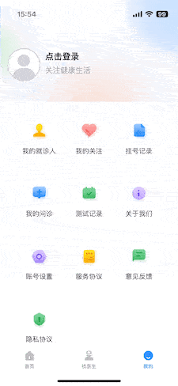

# PopupBottom 如果好用给个 Star ！

##### 由于项目里的各种弹出框特别多，每次加载一个 window 在隐藏，或者在 View 里加一个 View 嵌套很复杂，还容易出问题，就自己自定义了一个 present 来做弹出框，大大降低了开发时间。
##### 方便之处在于，可以弹出 Xib 创建的 UIViewController，只需要继承 PopupBottomVC。

————————————————————— 2024.10.16 新加了方法回调 ————————————————————

```swift

/// 回调里 end 结束 立刻执行
/// コールバックで end が終了するとすぐに実行
public func popPanEnd() { }

/// 回调里 change 立刻执行
/// - Parameter point: 添加视图后转换的 point

/// コールバックで change が発生するとすぐに実行
/// - Parameter point: ビューを追加後に変換された point
public func popPanChange(_ point: CGPoint) { }

```

————————————————————————————————————————————————————————

#### GIF 示例 (不挂 VPN 查看不了 GIF)

<div style="display: flex; justify-content: space-between;">
  
  
  
</div>

# 一行代码即可调用！

## 如何使用

### 1, 继承 PopupBottomVC

```swift
class CustomVC: PopupBottomVC {
    // 设置区域高度，默认不用设置。
    override var currentViewHeight: CGFloat {
        return SCREEN_HEIGHT
    }

    // 是否添加手势，默认添加。
    override var isAddGestures: Bool {
        return false
    }

    // 是否显示背景颜色，默认黑色半透明背景。
    override var isShowBlackView: Bool {
        return false
    }

    override func viewDidLoad() {}
}
```

#### 2, 调用 PopupBottomVC

```swift
   let pushVC = CustomVC()

   // 视图消失回调
   hiddenPopupBottomView() {}

   popupBottomVC(pushVC)

   popupBottomVC(pushVC) {}
```

#### 3, 关闭 PopupBottomVC

```swift
   hiddenPopupBottomVC()
```

# PopupBottom が便利なら、ぜひ Star をお願いします！

##### プロジェクト内ではさまざまなポップアップが多く、毎回 window をロードして非表示にしたり、View に View をネストするのは複雑で、問題が発生しやすかったため、自分でカスタムした present を使ってポップアップを作ることにしました。これで開発時間が大幅に短縮されました。
##### 便利な点は、Xib で作成した UIViewController をポップアップできるところです。PopupBottomVC を継承するだけで OK です。

# 1行コードで呼び出し可能！

## 使用方法

### 1, PopupBottomVC を継承

```swift
class CustomVC: PopupBottomVC {
    // エリアの高さを設定します。デフォルトでは設定不要です。
    override var currentViewHeight: CGFloat {
        return SCREEN_HEIGHT
    }

    // ジェスチャーを追加するかどうか。デフォルトでは追加されます。
    override var isAddGestures: Bool {
        return false
    }

    // 背景色を表示するかどうか。デフォルトは黒の半透明背景です。
    override var isShowBlackView: Bool {
        return false
    }

    override func viewDidLoad() {}
}
```

#### 2, PopupBottomVC を呼び出す

```swift
   let pushVC = CustomVC()

   popupBottomVC(pushVC)

   popupBottomVC(pushVC) {}

   // ビューが閉じたときのコールバック
   hiddenPopupBottomView() {}

```

#### 3, PopupBottomVC を閉じる

```swift
   hiddenPopupBottomVC()
```


# If PopupBottom is helpful, please give it a Star!

##### Due to the large number of pop-up windows in the project, it was inconvenient to handle them individually, either by loading a window and then hiding it, or by adding a view in the "View" section, which looked awkward. Therefore, I customized a "present" function to handle pop-up windows. This significantly reduced development time.

##### The convenience lies in the ability to present a UIViewController created from an Xib.

<div style="display: flex; justify-content: space-between;">
  
  
  
</div>

## How to use

### 1, Inherit PopupBottomVC

```swift
class CustomVC: PopupBottomVC {
    // Set the area height, no need to set by default.
    override var currentViewHeight: CGFloat {
        return SCREEN_HEIGHT
    }

    // Is gesture added by default.
    override var isAddGestures: Bool {
        return false
    }

    // Is the background color displayed? Default is a black semi-transparent background.
    override var isShowBlackView: Bool {
        return false
    }

    override func viewDidLoad() {}
}
```

#### 2, Invoke PopupBottomVC

```swift
   let pushVC = CustomVC()

   popupBottomVC(pushVC)

   popupBottomVC(pushVC) {}

   // View disappearance callback
   public func hiddenPopupBottomView() {}
```

#### 3, Close PopupBottomVC

```swift
   hiddenPopupBottomVC()
```

## 如有问题或疑问，请通过电子邮件或 QQ 联系我！

##### If you have any questions or concerns, please contact me via email or QQ!

E-mail：matsonga@163.com
